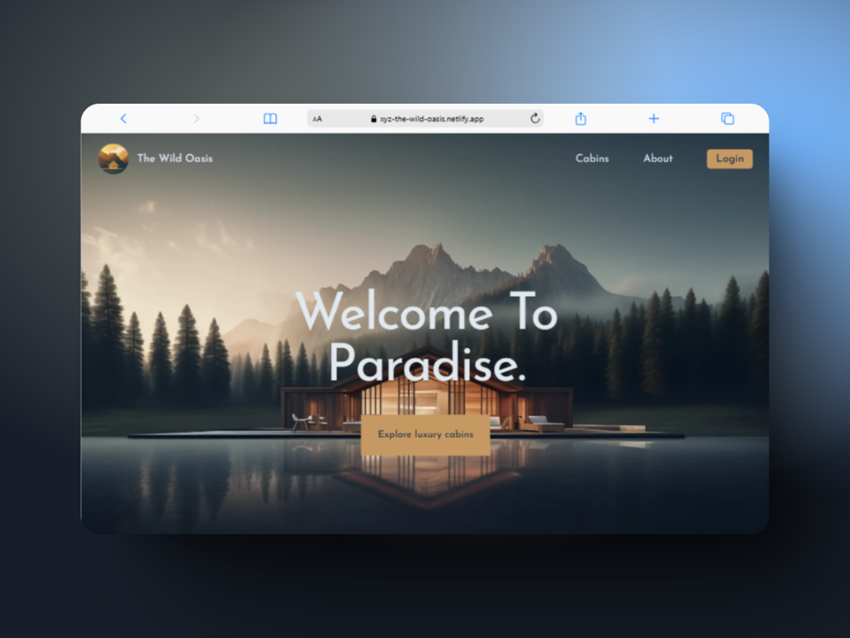

<div align="center">
  <h1>The Wild Oasis 🌿</h1>
  <p align="center">
    A demo luxury cabin booking platform built with Next.js, Tailwind CSS, and Supabase
  </p>
    <!-- Project Links -->
  <p align="center">
    <br />
    <a href="https://xyz-the-wild-oasis.netlify.app" target="_blank">View Demo</a>
    ·
    <a href="https://github.com/xyzeez/the-wild-oasis/issues/new?template=bug_report.md" target="_blank">Report Bug</a>
    ·
    <a href="https://github.com/xyzeez/the-wild-oasis/issues/new?template=feature_request.md" target="_blank">Request Feature</a>
  </p>
  <div align="center">
    
  </div>
</div>

## 📋 Table of Contents

- [About](#about)
- [Built With](#built-with)
- [Features](#features)
- [Getting Started](#getting-started)
  - [Prerequisites](#prerequisites)
  - [Installation](#installation)
- [Environment Variables](#environment-variables)
- [Deployment](#deployment)

## 🎯 About

The Wild Oasis is a demo project showcasing a luxury cabin booking platform where guests can explore available cabins, make reservations, and manage their bookings. Built with modern web technologies, it offers an intuitive interface for users to find their perfect cabin getaway, check availability through an interactive calendar, and handle their reservations efficiently.

## 🛠 Built With

- 
- 
- 
- 

## ✨ Features

- Interactive cabin browsing and detailed cabin views
- Real-time availability calendar
- Secure user authentication and guest accounts
- Flexible booking management system
  - Create new reservations
  - Modify existing bookings
  - Cancel reservations
- Smart date selection with booking restrictions
- Guest capacity management
- Automated price calculations with discount support
- Responsive design for all devices
- User-friendly booking interface
- Personal dashboard for managing reservations

## 🚀 Getting Started

### Prerequisites

- Node.js (v18 or higher)
- npm or yarn
- Supabase account

### Installation

1. Clone the repository

   ```bash
   git clone https://github.com/xyzeez/the-wild-oasis
   cd the-wild-oasis
   ```

2. Install dependencies

   ```bash
   npm install
   # or
   yarn install
   ```

3. Set up environment variables

   ```bash
   cp .env.local
   ```

4. Start the development server
   ```bash
   npm run dev
   # or
   yarn dev
   ```

## 🔑 Environment Variables

Create a `.env.local` file in the root directory with the following variables:

```env
NEXT_PUBLIC_SUPABASE_URL=your_supabase_url
NEXT_PUBLIC_SUPABASE_ANON_KEY=your_supabase_anon_key
NEXT_PUBLIC_SITE_URL=your_site_url
AUTH_SECRET=your_auth_secret
```

## 🚀 Deployment

The application can be deployed to Vercel or any other hosting platform that supports Next.js applications. To build the project:

```bash
npm run build
```

Then start the production server:

```bash
npm start
```
